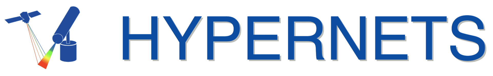
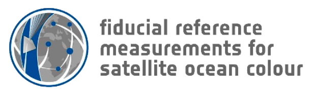

Here's the ever-growing list of the projects and organisations which have utilised CoMet's capabilities!

## 🗸 QA4EO

- QA4EO is a Quality Assurance framework for Earth Observation data, providing guidance and best practices across the EO community. 

## 🗸 HYPERNETS 

- HYPERNETS developed an automated network of hyperspectral radiometers for validating surface reflectance of water and land for satellite missions

## 🗸 Met4EO
- Met4EO applies meteorological data and modelling to enhance satellite-based Earth observation for services like weather forecasting.

## 🗸 TACOS
- TACOS uses advanced remote sensing techniques to monitor terrestrial and aquatic environments through atmospheric and sensor calibration.

## 🗸 CHIME L2
- CHIME L2 provides level‑2 calibrated Earth Observation products, integrating calibration and atmospheric correction pipelines.

## 🗸 FLEX validation
- FLEX validation supports the calibration and validation of ESA’s Fluorescence Explorer mission using ground-based and airborne measurements.

## 🗸 LIME
- LIME focuses on land and inland water monitoring through the use of improved multispectral remote sensing methods.

## 🗸 FRM4SOC
- FRM4SOC implements calibration and validation protocols for satellite-derived stratospheric and tropospheric composition using ground-based instrumentation.

## 🗸 RPV4PICS
- RPV4PICS advances reflectance product validation for planetary imaging and calibration systems using remote and in situ data.

## 🗸 MACRAD
- MACRAD combines microwave and radar observations to improve atmospheric profiling and surface parameter retrievals from satellite.

## 🗸 FDR4ATMOS
- FDR4ATMOS develops methodologies for full‐disclosure radiometry in atmospheric remote sensing to support climate monitoring.

## 🗸 DTE-S2GOS
- DTE‑S2GOS integrates Digital Twin Earth models with Sentinel‑2 geometric and radiometric observations for enhanced Earth system monitoring.

## 🗸 DEFLOX
- DEFLOX studies satellite-based fluorescence detection to monitor phytoplankton and chlorophyll dynamics in aquatic ecosystems.

## 🗸 FRM4FLUO
- FRM4FLUO establishes standards for the calibration and validation of satellite-derived fluorescence measurements of vegetation.
