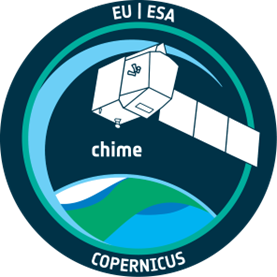
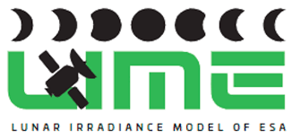
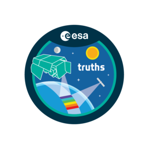
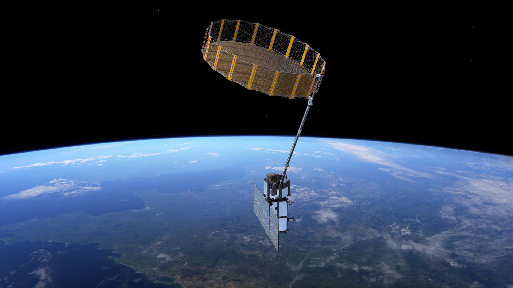
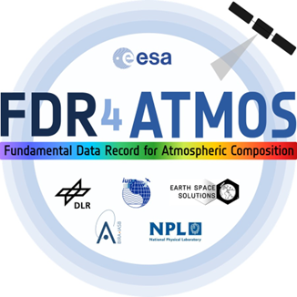
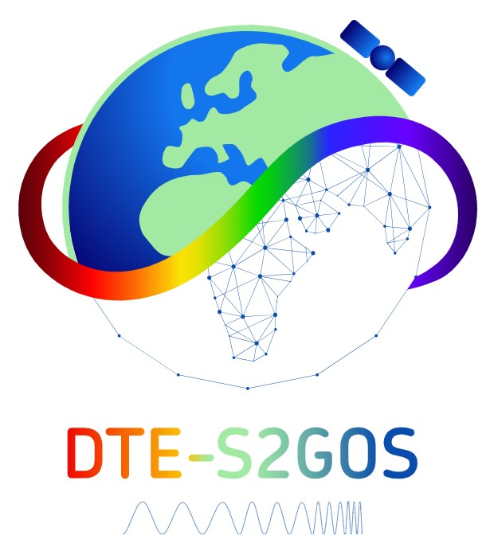
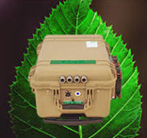
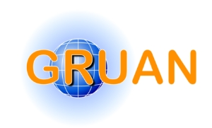

Here's the ever-growing list of the projects and organisations which have utilised CoMet's capabilities!

## 🗸 QA4EO

📋 **Overview:** QA4EO is a Quality Assurance framework for Earth Observation (EO) data, providing guidance and best practices across the EO community. 

🔗 **Links:** [**QA4EO Website**](https://www.QA4EO.org/)

☄️ **Involvement:** The CoMet toolkit received funding from QA4EO for its development and provides the tools for the practical implementation of some of the QA4EO steps to an uncertainty budget.

## 🗸 HYPERNETS 

📋 **Overview:** HYPERNETS developed an automated network of hyperspectral radiometers for validating surface reflectance of water and land for satellite missions.

🔗 **:Links:** [**HYPERNETS Website**](https://www.hypernets.eu/network/summary)

☄️ **Involvement:** The CoMet toolkit is used within the HYPERNETS_processor to propagate uncertainties from lab calibration through each of its products. See also [this case study page](user-guide/case-studies/hypernets).

## 🗸 CHIME L2

📋 **Overview:** The CHIME L2 project performs atmospheric correction for the Copernicus Hyperspectral Imaging Mission for the Environment (CHIME).

[//]: # (🔗 **Links:** [****]&#40;&#41;)

☄️ **Involvement:** CoMet is used for the uncertainty propagation through the atmospheric correction algorithms.

## 🗸 FLEX validation

📋 **Overview:** FLEX validation supports the calibration and validation of ESA’s Fluorescence Explorer mission using ground-based and airborne measurements.

[//]: # (🔗 **Links:** [****]&#40;&#41;)

☄️ **Involvement:** The CoMet toolkit is used to ensure the validation results are accompanied by uncertainties, and thus can be reliably interpreted.

## 🗸 LIME

📋 **Overview:** LIME is the Lunar Irradiance Model of the European Space Agency (ESA), which aims to determine an improved lunar irradiance model with sub-2% radiometric uncertainties.

🔗 **Links:** [**LIME Website**](https://lime.uva.es/)

☄️ **Involvement:** These uncertainties are propagated through the LIME toolbox using CoMet.
  

## 🗸 Met4EO

📋 **Overview:** Met4EO aims to develop, apply and extend a metrological approach to the uncertainty analysis and comparison of satellite data products.

[//]: # (🔗 **Links:** [****]&#40;&#41;)

☄️ **Involvement:** The CoMet toolkit will be used in a range of its case studies.
  
## 🗸 TACOS

📋 **Overview:** The TRUTHS mission Accompanying Consolidation Towards Operations Study (TACOS) performs scientific studies in preparation of the TRUTHS mission.

[//]: # (🔗 **Links:** [****]&#40;&#41;)

☄️ **Involvement:** The CoMet toolkit is used for uncertainty propagation in various parts.

## 🗸 FRM4SOC

📋 **Overview:** FRM4SOC sets out to define above-water ocean colour radiometry best practice for measurement and uncertainty propagation, for two radiometers in common usage, being implementing into an open source community processor.

🔗 **Links:** [**FRM4SOC Website**](https://frm4soc.org/)

☄️ **Involvement:** CoMet has been used heavily to propagate uncertainties through a complicated measurement system and provide uncertainty outputs for L1 and L2 products.

## 🗸 RPV4PICS

📋 **Overview:** RPV4PICS advances reflectance product validation for satellite data using improved BRDF and aerosol modelling over Pseudo Invariant Calibration Sites (PICS).

[//]: # (🔗 **Links:** [****]&#40;&#41;)

☄️ **Involvement:** Uncertainties were propagated using CoMet.
  

## 🗸 MACRAD

📋 **Overview:** - The Metrological Analysis of CIMR Radiometry (MACRAD) study.

[//]: # (🔗 **Links:** [****]&#40;&#41;)

☄️ **Involvement:** Uses CoMet to propagate uncertainties for the Copernicus Imaging Microwave Radiometer (CIMR) mission.

## 🗸 FDR4ATMOS

📋 **Overview:** - FDR4ATMOS develops methodologies for full‐disclosure radiometry in atmospheric remote sensing to support climate monitoring.

[//]: # (🔗 **Links:** [****]&#40;&#41;)

[//]: # ()
[//]: # (☄️ **Involvement:**)

## 🗸 DTE-S2GOS

📋 **Overview:** The Digital Twin Earth Synthetic Scene Generator and Observation Simulator (DTE-S2GOS) project focuses on developing a new pre-operational service to be implemented as a component of the ESA DestinE Platform.

🔗 **Links:** [**S2GOS Website**](https://dte-s2gos.rayference.eu/)

☄️ **Involvement:** Validation of this service needs a metrological approach, which is implemented using CoMet.

## 🗸 DEFLOX

📋 **Overview:** DEFLOX is a project supporting the development of the FloX system for Solar induced Chlorophyll Fluorescence observation. 

[//]: # (🔗 **Links:** [****]&#40;&#41; )

☄️ **Involvement:** The CoMet Toolkit is being used to develop uncertainty propagation through the FLOX processing chain.

## 🗸 FRM4FLUO

📋 **Overview:** - FRM4FLUO establishes standards for the calibration and validation of satellite-derived fluorescence measurements of vegetation.

[//]: # (🔗 **Links:** [****]&#40;&#41;)

[//]: # (☄️ **Involvement:**)

## 🗸 GRUAN

📋 **Overview:** Global Climate Observing System (GCOS) ensures access to long-term climate observations. Within GCOS, the GCOS Reference Upper-Air Network (GRUAN) plays a key role by providing reference-quality atmospheric balloon data.

🔗 **Links:** [**GRUAN Website**](https://www.gruan.org/)

☄️ **Involvement:** A case study where the CoMet Toolkit has been successfully implemented with GRUAN data to acquire covariance information of GRUAN data. Read more on [the case study page](user-guide/case-studies/gruan).

